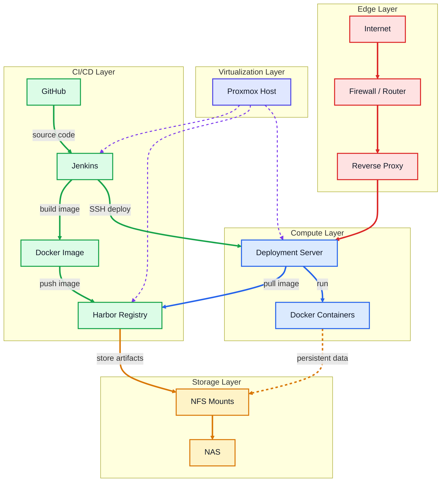
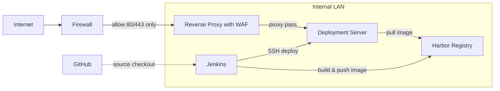
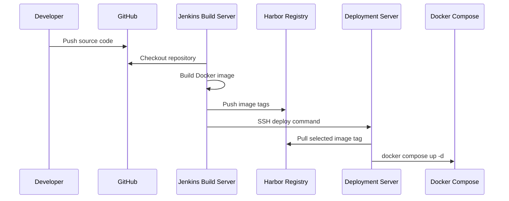

# HTML Docker Deployment Test

A minimal static HTML project for validating a self-hosted CI/CD pipeline using Jenkins, Harbor, Docker Compose, and a homelab-style infrastructure layout.

---

## Overview

This project is used to test the following deployment flow:

```text
GitHub -> Jenkins -> Docker Build -> Harbor -> Deployment Server -> Docker Compose
```

The application itself is intentionally simple: a static HTML page served by Nginx inside a Docker container.

---

## Infrastructure Architecture



### Legend

| Color | Meaning |
| --- | --- |
| Red | Public / edge traffic |
| Purple dashed | Proxmox virtualization placement |
| Green | CI/CD build and deployment commands |
| Blue | Runtime container deployment |
| Orange | NAS / NFS storage flow |
| Orange dashed | Optional persistent application data |

---

## Security & CI/CD Architecture



---

## CI/CD Flow



---

## Image

```text
reg.yangdongi.com/library/test:<build-number>
reg.yangdongi.com/library/test:latest
```

The build-number tag is used for traceable deployments and rollback.  
The `latest` tag points to the most recent successful build.

---

## Deployment

The service is deployed with Docker Compose:

```yaml
services:
  test:
    image: reg.yangdongi.com/library/test:${IMAGE_TAG:-latest}
    container_name: test
    restart: unless-stopped
    ports:
      - "${APP_PORT:-8080}:80"
```

Manual deployment example:

```bash
IMAGE_TAG=latest APP_PORT=8080 docker compose pull
IMAGE_TAG=latest APP_PORT=8080 docker compose up -d
```

---

## Pipeline Steps

1. Jenkins checks out the repository from GitHub.
2. Jenkins builds the Docker image.
3. Jenkins tags the image with both the Jenkins build number and `latest`.
4. Jenkins pushes the image to Harbor.
5. Jenkins connects to the deployment server over SSH.
6. The deployment server pulls the selected image tag.
7. Docker Compose recreates the running container.

---

## Notes

- Only the reverse proxy is exposed through the firewall.
- Jenkins, Harbor, deployment servers, and NAS remain inside the internal LAN.
- Harbor stores image artifacts on NAS-backed NFS storage.
- Deployment servers pull images from Harbor and run services with Docker Compose.
- Jenkins URLs, credentials, SSH keys, private IPs, and internal server details are intentionally not exposed in this repository.
- Harbor credentials and SSH keys are managed outside of the repository.
- Build-number tags are used for rollback-friendly deployments.
- This repository is intended as a lightweight CI/CD pipeline validation example.
combined-infra-readme.md
7KB
